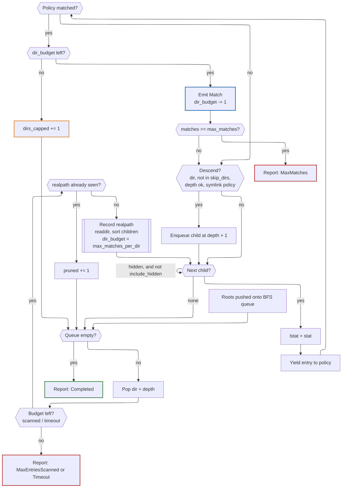
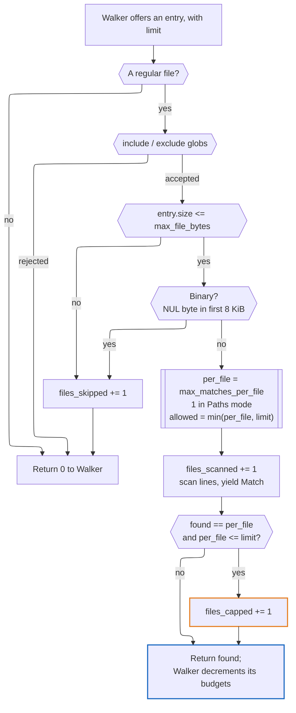
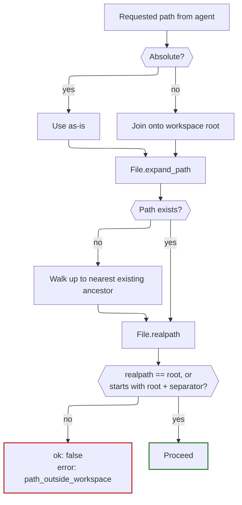

# FsUtils — Design

File system utilities as Crystal classes, so a program can search and edit a
tree without shelling out. Zero runtime dependencies; stdlib only.

The shard has two audiences and they want opposite things.

A **Crystal caller** wants a stream: yield me matches as you find them, let me
decide what to keep, raise if I passed nonsense. An **AI agent** wants a
document: give me a bounded, self-describing JSON blob, never raise, and tell me
what you *didn't* show me. Trying to serve both from one class produces something
that serves neither, so the shard is two layers.

```
FsUtils::Tools                              # workspace-confined, buffered, JSON, never raises
      │
      ├── Find   Grep                       # searching: streaming, typed, may raise
      │     └──────┬──────┘
      │     Walker(P)                       # one bounded breadth-first traversal
      │     Walk                            # Entry, Report, Policy
      │
      ├── Reader  Writer  Replacer          # text: whole-file, typed, may raise
      │     └────────┬────────┘
      │     Text                            # binary sniffing, line clamping
      │
      ├── Web::Fetcher  Web::HtmlToMarkdown # the one tool that leaves the machine
      │     └── Web::HostPolicy             # resolve, then compare -- for hosts
      │
      └── Scratch                           # results too large to return inline
            └── Outline                     # Markdown headings -> line ranges

FsUtils::Error / ErrorCode                  # the failure vocabulary, shared by both
```

The searching side streams because a walk can find more than fits in memory.
The text side does not: a file small enough to edit is small enough to hold, and
`Replacer` in particular needs the whole before and after in hand at once to cut
its report from them.

## The thesis, stated once

Every scan is bounded, and *saying that it was bounded* is part of the result.

A human who gets 40,000 hits scrolls past them. An agent cannot see a runaway
scan, cannot press Ctrl-C, pays for every result in tokens, and will then draw
confident conclusions from whatever fragment it happened to see. An agent that
cannot distinguish "there are no more matches" from "I gave up" will cheerfully
report the wrong answer. Hence: caps everywhere, a `stop_reason` on every result,
and a traversal order chosen so that an exhausted budget still yields something
useful.

---

## `FsUtils::Walker`

The traversal core. It knows about directories, budgets, cycles and clocks; it
has no opinion about what makes a match. `Find` and `Grep` are policies layered
over it.

### Generic over its policy

`Walker(P)` takes its policy as a type parameter rather than as an abstract base
class. With a concrete `P`, Crystal monomorphises and inlines the policy calls
exactly as it would a block — so the traversal-object pattern costs nothing over
the `yield` it replaces. Typing the policy as a shared parent would put a vtable
back in the inner loop for no benefit whatever.

`Walk::Policy` is therefore a *module* documenting the contract, included by
policies so the compiler checks them, but never used as a type. Policies may be
structs; they live for exactly one `run`.

```crystal
def visit(entry : Entry, limit : Int32) : Int32   # returns matches emitted
def enter_dir(dir : String, depth : Int32) : Bool # false to prune
def leave_dir(dir : String, depth : Int32) : Nil
```

`limit` is the walker's budget arithmetic made explicit:
`min(remaining directory quota, max_matches - matches so far)`, always positive.
A policy may narrow it — `Grep` applies its own per-file cap — but never exceed
it; a return above `limit` is clamped rather than trusted. A policy is free to
spend the whole limit on one entry, which is precisely what `Grep` does when a
single file yields twenty matches.

Putting the arithmetic here rather than in each helper is the point of the
exercise: the per-directory budget is the thing both helpers previously got
subtly wrong, and it now exists in one place.

### Breadth-first, on purpose

`find(1)` is depth-first, which is exactly wrong here. Depth-first plus a match
limit means the first deep directory you fall into eats the entire budget:
`node_modules` wins, your source tree is never looked at.

Breadth-first spends the budget level by level, so results spread across the top
of the tree — which is where the interesting code lives. Combined with a
per-directory quota, a single fat directory contributes at most its share and is
then skipped for matching purposes; its children are still queued. A buffet with
a serving spoon, rather than a queue of people with buckets.

Children are sorted before queueing, so two runs over an unchanged tree produce
identical output. Reproducibility is worth more to an agent, and to a spec, than
raw speed.

### Budgets

Five independent brakes, each with a default a caller gets for free:

Limit                |Default|Stops                        
---------------------|-------|-----------------------------
`max_matches`        |1_000  |Context blow-out             
`max_matches_per_dir`|100    |One directory dominating     
`max_entries_scanned`|100_000|Needle-free haystacks        
`timeout`            |10s    |Network mounts, spinning rust
`max_depth`          |32     |Pathological nesting         

Plus `skip_dirs`, one deny-list (`Walk::DEFAULT_SKIP_DIRS`) of the usual
sinkholes shared by both helpers
(`.git`, `.hg`, `.svn`, `node_modules`, `lib`, `vendor`, `.venv`, `target`,
`build`, `dist`, `__pycache__`, `.cache`, `.terraform`, `.next`). Pass
`skip_dirs: [] of String` to disable.

Errors — unreadable directories, files that vanish mid-walk — are collected in
`errors`, never raised. A permissions hiccup halfway through should degrade a
result, not destroy it.

### Symlinks and loops

Default `follow_symlinks: false`: symlinks are reported, and matchable as
`type: :symlink`, but never descended. That alone makes cycles impossible.

With `follow_symlinks: true`, each directory is resolved with `File.realpath`
before entry and recorded in a `Set(String)`; a second visit is pruned. This
deduplicates overlapping roots (`["src", "src/."]`) for free. `realpath` costs a
syscall per directory, which is noise next to the `readdir` that follows it.
`max_depth` is the belt to that pair of braces.

### The loop



### `Report`

`Walk::Report` carries `matches`, `scanned`, `directories`, `pruned`,
`dirs_capped`, `errors`, `elapsed` and `stop_reason`. `truncated?` is true when
the stop reason is anything but `Completed` **or** when `dirs_capped > 0`: a
capped directory means the caller saw a sample, whatever the stop reason says.

`dirs_capped` belongs here rather than to `Grep` because `Walker` owns the
per-directory budget, and a counter should live with the thing that decrements
it. Each helper composes this record into its own report — `Grep` adds
`files_skipped` and `files_capped` — rather than inheriting from it, so neither
carries fields that mean nothing to it.

---

## `FsUtils::Find`

A `find(1)`-flavoured filter over `Walker`. Nothing is buffered: the block sees
each hit as it is found, so memory is O(frontier), not O(results).

```crystal
report = FsUtils::Find.new("src", name: ["*.cr"]) { |s| s.max_matches = 200 }.run do |m|
  puts "#{m.path} (#{m.size} bytes)"
end
report.truncated? # => did we stop early, and why
```

`Match` carries `path`, `name`, `type` (file / directory / symlink / other),
`size`, `modification_time`, `depth`, `symlink?`. A record rather than a tuple,
so fields can be added without breaking callers.

**Matching.** `name:` globs match the basename; `path:` globs match the *whole*
path, so they nearly always want a leading `**/` — a single `*` does not cross a
`/`. `exclude:` matches either. Globs are OR-ed within a list and AND-ed across
lists; an empty list means "no opinion". `case_insensitive:` downcases both
sides: crude, correct for ASCII, good enough for filenames.

**Filters.** `type`, `min_size`/`max_size`, `newer_than`/`older_than`,
`min_depth`.

**Omitted deliberately.** No `-exec`, no boolean expression grammar, no
`-printf`. An agent composing shell fragments is a hazard; a typed constructor
is not. Content search belongs in `Grep`.

---

## `FsUtils::Grep`

Content search over the same traversal. Matches are yielded as found — the class
never accumulates a result array, so memory stays flat regardless of tree size.

```crystal
report = FsUtils::Grep.new("TODO", "src") { |s| s.max_matches = 200 }.run do |m|
  puts "#{m.relative_path}:#{m.line_number}:#{m.column}: #{m.line}"
end
```

`Match` carries `path`, `relative_path`, `line_number`, `column`, `line`,
`matched`, `truncated_line?`. Enough to cite a result; not so much that the
struct becomes a second file API.

`relative_path` is resolved against whichever root the file falls under, longest
root first, with a separator check — a bare prefix test would report
`/srv/project-secrets/x` as being inside `/srv/project`. With no root matching,
the absolute path is returned rather than a mangled one.

`Report` composes `Walk::Report` and adds `files_scanned`, `files_skipped` and
`files_capped`; `truncated?` accounts for the last of those as well as the
walk's own verdict.

### Output modes

`Mode::Lines` (default) yields one `Match` per matching line. `Mode::Paths`
yields one `Match` per *file* — the first hit — then abandons it. The
distinction is a token budget, not a formatting preference: "which files mention
`AuthToken`" is the cheap reconnaissance step, and an agent forced to pull
matching lines to learn a filename pays twenty times over for the privilege.
Early exit makes it markedly faster too.

Under `Paths`, `max_matches` counts files and `max_matches_per_file` is ignored.
The mode reinterprets the caps rather than silently dropping them, which is why
it is an enum and not a boolean flag.

### Type filters

`types: ["cr", "yaml"]` expands via the `TYPES` map into globs unioned with
`include`. Sugar, but sugar that stops a caller hand-rolling `*.{cr,ecr}` and
quietly missing half the files. Unknown names raise — a silent empty result is
the worst possible failure mode for a caller that cannot see the filesystem.

### Scanning one file

`Walker` decides *which* files are offered and hands over a `limit`; `Grep`
decides how much of that allowance it can afford to spend. This is where the
policy contract earns its keep — `Find` ignores `limit`, `Grep` lives by it.

The file's size comes from the entry the walker already stat-ed, so the scanner
never pays for a second syscall to decide whether a file is too big to open.



Three caps converge on every file, and they answer three different questions:
*have I spent my whole budget?* (`max_matches`), *is this one directory drowning
me?* (`max_matches_per_dir`), and *is this one file drowning me?*
(`max_matches_per_file`). The walker folds the first two into `limit` and owns
their counters; only the third belongs to `Grep`.

Hence the condition on `files_capped`. It fires only when the file's own cap was
the binding constraint. If `limit` was tighter, the shortfall is already
explained by `dirs_capped` or a `MaxMatches` stop, and claiming it here would
report the same lost match twice — leaving an agent to conclude that two
different things went wrong when only one did.

### Additional guard rails

Binary sniffing and long-line clamping live in `FsUtils::Text`, not in `Grep`:
the file-reading tools ask exactly the same two questions, and answering them in
two places is how the answers drift apart. `Text.clamp` returns the number of
characters dropped rather than a boolean, because `Grep` only needs to know
*that* a line was cut while a reader needs to say how much it lost.

Risk                               |Mitigation                                                   
-----------------------------------|-------------------------------------------------------------
Binary files: noise in, garbage out|Sniff first 8 KiB for a NUL byte; skip                       
Huge files                         |`max_file_bytes`, default 5 MB                               
One 2 MB line of minified JS       |`max_line_length`, default 1000; `truncated_line?` flags it  
One lockfile matching on every line|`max_matches_per_file`, default 20; counted in `files_capped`
Pathological regex                 |Timeout checked between files and every 256 lines            
Sheer file count                   |`max_entries_scanned`, default 20,000                        
Unreadable files, races, bad UTF-8 |Rescued per file, counted in `files_skipped`, never fatal    

Only a bad pattern or an unknown type name raises, and both are caller error
caught at construction. A missing root is *not*: like anything else the
filesystem throws at us it lands in `errors`, matching `Find`. That costs a
caller who typos a root an empty result they must read `errors` to explain,
which is the right trade for one vocabulary across both helpers — and `Tools`
checks existence itself anyway, so an agent still gets a clean `path_not_found`.

### Omitted deliberately

No context lines (`-A`/`-B`/`-C`), no `-v`, no parallelism, no `.gitignore`
parsing, no multiline patterns. Context lines in particular change the shape of
`Match` and decouple *matches* from *lines yielded*, at which point `Report`
needs a `lines_yielded` counter so a caller can see what it actually spent.
Each is easy to bolt on later; none is needed to make the tool useful.

---

## Shared vocabulary

The searching helpers use one set of names and defaults, because an agent that
has learned one tool should not be ambushed by the next.

Concept           |Decision                                                                
------------------|------------------------------------------------------------------------
Result object     |`Walk::Report`, composed into each helper's own; `truncated?`           
Why we stopped    |`StopReason` — `Completed`, `MaxMatches`, `MaxEntriesScanned`, `Timeout`
Roots             |`Array(String)`, with a single-`String` convenience overload            
Hidden entries    |`include_hidden: false` — agents rarely want dotfile churn              
Time limit        |`timeout : Time::Span`                                                  
Skip list         |one `Walk::DEFAULT_SKIP_DIRS`                                           
Failure           |`FsUtils::Error`; `ArgumentError` reserved for genuine programmer error 
Filesystem trouble|collected into `errors`, never raised                                   

A helper instance is single-use per `run` and not thread-safe. Spawn a new one.
The same holds for the text helpers, whose entry points are `read`, `write` and
`replace` rather than `run` — each does one thing to one file and is then spent.

Across both sides the constants that matter are the same three: `FsUtils::Error`
for caller error with an optional `suggestion`, `FsUtils::ErrorCode` for its
kind, and `FsUtils::Text` for questions about content.

---

## The text helpers

`Reader`, `Writer` and `Replacer` read and edit one file at a time. They share
the searching side's contract — raise on caller error, know nothing of workspace
confinement or JSON — and share `FsUtils::Text` for the two questions any of them may need
to ask about content: is this binary, and is this line absurdly long.

They do not share `Walker`, because none of them traverses anything.

### `Reader`

One streaming pass renders the requested window and counts every line to the
end. The second half of that costs a pass over the tail for no output, and is
worth it: `total_lines` is then exact, and an exact total is what lets a caller
judge how much it is missing without a second call. An estimate would make the
notice's "of 8,431" a guess in the one field used to decide whether to read on.

Output is line-numbered by default, `cat -n` style, and the numbers are the
file's own — a read at `offset: 12` opens at `12`, not at `1`. The numbering is
an address space: without it a model cannot cite a region, cannot construct a
targeted follow-up read, and must re-read the whole file to recover. Nothing
announces that failure; it simply reasons more vaguely. Numbers present when
unwanted cost a few tokens a line, which is the cheaper mistake, so the default
sits there.

Numbers also make truncation legible. On a view of lines 2001–4000 the content
states its own position at every line, independent of the `range` field —
redundancy exactly where position is easiest to lose.

**Two truncation policies**, and the distinction is the tool's most consequential
behaviour. An *implicit* read that overflows returns the first page and a notice:
the caller asked for the file, so a page is a helpful answer. An *explicit* range
that overflows is refused: the caller asked for something precise and was wrong
about its size, and quietly returning less would let it proceed believing it saw
the whole span.

That requires knowing whether a range was asked for, which is why `offset` and
`limit` are nilable at the tool boundary rather than defaulted. Defaults in the
signature would erase the distinction before anything could act on it.

Overflow is measured in bytes, not lines: 500 lines of minified JSON can exceed
a budget that 5,000 lines of source would not. Individual lines are clamped
separately, which sets `truncation_reason` but not `truncated` — a file whose
lines are mostly clamped is a file that wants `grep`, and the notice says so.

An empty file and an offset past the end are **answers, not errors**. Both come
back `ok: true` with a notice, because a model that cannot tell "empty" from
"missing" concludes the wrong thing about both.

### `Writer`

Whole files only. Partial changes are `Replacer`'s job, and giving one schema
two parameter vocabularies and two guards would serve neither.

Content is written exactly as supplied: no trailing newline appended, no line
endings normalised, no whitespace trimmed. Anything the tool adds makes its
output differ from its input, which is a small lie told in the one place
precision matters — and it would undermine the claim, once a session log exists,
that a write is as good as a read because the caller supplied the bytes.

Writes are atomic: temp file in the destination directory, `fsync`, inherit the
destination's permissions, rename. A failed write leaves the original intact
rather than truncated, which matters most in exactly the case the overwrite
guard protects — replacing a file the caller cannot reconstruct.

**The guard is policy and lives in `Tools`, not here.** `Writer` will replace
whatever it is pointed at. A Crystal caller writing a file it just composed does
not need to be asked twice; a language model does. The asymmetry that makes the
guard acceptable is that `overwrite: false` never destroys anything in any
state: a call that sometimes refuses is recoverable, because the error names the
missing precondition and the caller satisfies it in one step, whereas a call
that sometimes destroys is not, because nothing tells the caller which world it
was in until the content is gone.

Missing parent directories are created without a guard, because creating a
directory destroys nothing — the worst outcome is an empty directory in the
wrong place, which is visible and trivially removed. They are *reported*, which
catches the failure a flag would have caught: a write to `src/harnes/main.cr`,
typo included, succeeding silently.

### `Replacer`

String-addressed editing, literal matching only. Four rules:

1. **Assert, do not select.** The caller states what it believes about the file;
   the tool verifies or refuses. It never picks a match on the caller's behalf.
2. **Fail loudly, never at the wrong place.** A silent edit at an unintended
   location is worse than any refusal.
3. **Show the work.** Every replacement comes back in context.
4. **Match literally.** No regular expressions, no fuzzy inference.

**Why `replace_all` is a boolean** rather than an index or a count. An ordinal
selector — *replace the third match* — asks the caller to have counted correctly
in a file it may have read only in part, and when the count is wrong the edit
succeeds at the wrong location, silently. A count assertion fails safely where an
ordinal does not, but still asks for a tally across the whole file, which is
guesswork after a partial read. A boolean asks for neither: `false` asserts
*there is exactly one*, which a caller can know from having read the region, and
`true` covers the rename case where the count is irrelevant. The real
distribution of edits is one or all.

**Hunks are sliced from real content**, `before` from the file as read and
`after` from the file as written. Neither is recomputed by re-applying the
substitution to a snippet. A recomputed `after` would make the report a
re-derivation of the edit rather than evidence of it: should the splice and the
recomputation diverge, the result would assert the right thing happened while
the wrong thing sat on disk. Recomputation also has a specific bug — applying a
first-match substitution inside an expanded window can hit an earlier occurrence
that context expansion pulled into view, not the one actually edited.

Windows expand three lines either side and merge when they overlap or abut, so
two edits four lines apart give one hunk of seven lines rather than two with
duplicated context. That is why `replacements` is a separate field from
`hunks.size`. Each hunk carries both line ranges: `start_line_after` shifts by
the deltas of edits before it, `end_line_after` also absorbs the deltas within
it, and `lines_delta` tells a caller how stale its own line numbers now are.

**Indentation is diagnosed, not accommodated.** Exact-match failure, not
ambiguity, is how string editors mostly fail, and the usual response is to
soften matching until something hits — which produces a tool whose behaviour is
a function of more than its inputs and whose mistakes are invisible by
construction. Instead: a second pass with leading whitespace flattened locates
where the text *would* have matched, nothing is written, and the refusal names
the lines and the difference. The caller retries once, correctly. That costs a
turn, and the error message is where the cost is recovered.

Note the mismatch only bites across a newline. A single line indented less than
the file's is a literal substring of it and simply matches, which is correct and
surprising enough to be worth knowing.

---

## `FsUtils::Tools`

The agent-facing layer: methods that call a helper, buffer the results, and
serialise them. An instance rather than module-level singletons, because the
workspace root is state that must be set once and honoured on every call — a
global `configure` would make it ambient, and ambient is exactly what a
security boundary must not be.

```crystal
tools = FsUtils::Tools.new("/srv/project")
tools.grep(pattern: "TODO", paths: ["src"], max_matches: 100).to_json
```

Arguments are flat and JSON-friendly — strings, ints, string arrays; no
`Time::Span`, no enums — because they arrive from a model as JSON in the first
place. Enum-ish arguments (`type`, `mode`) are taken as strings and parsed here,
so an unknown value becomes an error code rather than an exception.

There are six: `find` and `grep` for searching, `read`, `write` and
`text_replace` for text, and `fetch` for a web page. Each method returns its own
response type, not a serialised string. A host writes
`.to_json`; a Crystal caller can read `ok?` without re-parsing what was just
serialised. Nil fields are **omitted** rather than emitted as `null`, so a clean
result is a small one and a host can test for a key's presence.

### The workspace

**This layer refuses to leave its root.** The helpers are for trusted local
callers and take you wherever you point them; the tool layer assumes its caller
is a language model that may have read `../../.ssh/id_rsa` in a prompt somewhere
and thought it looked interesting.

The rule is: resolve, then compare — never validate the string before resolving
it, because `..` and symlinks both launder a string past a naive prefix check.



Three details that matter:

- **The separator check is not optional.** A bare `starts_with?(root)` lets
  `/srv/project-secrets` pass for root `/srv/project`. The same bug used to lurk
  in `Grep#relative`, which is what drew attention to it.
- **Resolve before comparing, and resolve the nearest *existing* ancestor** when
  the path itself does not exist, so a lookup of a missing file inside the
  workspace is a clean "not found" rather than a resolution error.
- **`follow_symlinks` is forced off** unless the caller explicitly enables it,
  and even then every resolved directory is re-checked against the root. A
  symlink inside the workspace pointing out of it is the obvious escape.

Paths in the response are returned relative to the workspace root. The agent
never sees the absolute layout of the host, which is both a small security win
and a meaningful token saving.

**It is a workspace, not a sandbox.** It was called the latter until 0.4.0, and
the word was wrong in two directions. A sandbox is disposable by connotation,
and what this fence surrounds is a user's real, durable work -- the point is
that the contents matter, which is why nothing may leave. And the shard already
has a genuinely disposable area, `Scratch`, so the connotation was attached to
the wrong one of the two. The rename also settled an inconsistency the code had
carried from the start: every tool description says "relative to the workspace
root" and none has ever said "sandbox", so the published surface had picked the
better word before the Crystal API did. The error code moved with it --
`path_outside_workspace` -- because that string is part of what a model reads,
and a code using a word its own descriptions never use is a small, real
incoherence in the model's input.

**One limitation, stated rather than hidden.** Resolving a path and then reading
it is not atomic. A symlink swapped between the two — by another process on the
same machine, in the window between the check and the open — could redirect the
read. Closing that properly means `openat` with `O_NOFOLLOW` against a held
directory descriptor, which is a substantially larger and more
platform-specific piece of work.

The gap is acceptable for the intended case, an agent reading a workspace whose
other occupants are trusted. It is *not* acceptable if a hostile local process
shares the filesystem, and anyone deploying this into that situation should know
they are relying on a check with a race in it.

### The envelope

Four fields are common to every tool, whatever it does — `ok`, `truncated`,
`notice` and `error` — and live in a `Tools::Envelope` module that each response
struct includes. Ivars from an included module serialise first, so `ok` leads
every response, which is the field a model branches on before reading anything
else.

Everything else belongs to the tool. `SearchResponse(T)` adds `results`,
`summary`, `stop_reason`, `errors` and `errors_omitted`; the coming file tools
will add fields of their own shape. One response type stretched across
searching, reading and writing would give most tools a majority of fields that
mean nothing to them, and a model no way to tell which.

Note what is **not** in the module. `path` is absent, though three of the four
planned responses have one, because a search has many paths inside its results
and no single one — a field missing from one member of a set is not common to
the set. `errors` and `errors_omitted` are absent because they exist for a
*walk*: a traversal accumulates filesystem trouble and carries on, where a read
either succeeds or fails.

`truncated` stays in the module even though its reasons differ completely — a
sampled walk in one tool, a prefix of a file in another. The reasons belong in
each response's own field (`stop_reason`, and a `truncation_reason` to come);
what is common, and what an agent needs to branch on, is the bare fact that it
is not looking at everything.

The searching tools' shape:

```json
{
  "ok": true,
  "results": [
    { "path": "src/find.cr", "line": 42, "column": 5, "text": "# TODO tidy this" }
  ],
  "summary": { "matches": 200, "scanned": 1180, "elapsed_ms": 91, "files_scanned": 96, "files_skipped": 3 },
  "truncated": true,
  "stop_reason": "max_matches",
  "notice": "Stopped at 200 matches; there may be more. Narrow with `include_globs` or a more specific pattern, or raise `max_matches`. 4 files hit their per-file quota; use `mode: \"paths\"` to see which files match instead.",
  "errors": ["src/vendor: permission denied"],
  "errors_omitted": 2
}
```

A clean, complete result carries only `ok`, `results` and `summary`; everything
below is absent unless it has something to say. Five things earn their place:

- **`notice`** is prose aimed at the model. `stop_reason: "max_matches"` is a
  fact; "narrow your query" is an action, and models act on the latter far more
  reliably than they reason from the former. It **accumulates**: a search can
  exhaust its matches, cap files, cap directories and overflow the output budget
  at once, and each adds a sentence carrying its own remedy. The per-file
  sentence points at `mode: "paths"`, which is the cheap reconnaissance step an
  agent would otherwise have to know to reach for unprompted.
- **`ok: false` with an `error` object, never an exception.** A raised Crystal
  exception becomes a stack trace in someone's tool harness. A JSON error is
  something the model can read and recover from. Error codes are a closed set —
  closed meaning enumerated in `FsUtils::ErrorCode`, not meaning short. A
  failure carries the error and nothing else — no empty `results` to be
  mistaken for "found nothing".

  The codes live in `FsUtils`, not `Tools`, because the helper that *detects* a
  failure is what knows its kind, and a helper naming a constant from the layer
  above it would invert the dependency. Each kind is a subclass of
  `FsUtils::Error` answering its own `code`; a bare `Error` answers nothing,
  which the tool layer reads as `invalid_argument`. The layer's whole
  translation is then `ex.code`.

  It was not always. The first version of the tool layer worked out what had
  gone wrong by searching the exception message for words like "binary" or
  "pattern" — which functioned exactly until someone rephrased a message, and
  which had been copied into three separate classifiers by the time the writer
  landed. Sniffing text for meaning that was known at the raise site is the
  same mistake as parsing `content` to find out which lines you were given.
- **`error.suggestion`**, separate from `error.message`. The message says what
  happened; the suggestion says what to do instead, and a model follows an
  instruction far more reliably than it derives one from a description. So
  `path_not_found` names a concrete `find_files` call to locate the file, and
  `invalid_pattern` points at `fixed_string: true` rather than leaving the
  caller to guess which metacharacter offended.

  It is carried on `FsUtils::Error` itself, so the code that *detects* the
  problem writes the advice — that code knows what the valid values were, where
  the tool layer would have to reverse-engineer it from a message string. The
  field is omitted when there is honestly nothing useful to say: an invented
  suggestion is worse than none, because it will be followed.
- **`errors` is capped** at ten (`Tools::MAX_ERRORS`), with `errors_omitted`
  counting the rest. Ten is enough to show the *shape* of the trouble — one
  unreadable directory, or a whole mount denied — while a walk across a
  permissions-denied filesystem would otherwise make the failures the entire
  response and push out the results the agent asked for.
- **`max_output_bytes`**, a limit that exists only at this layer. Grep lines vary
  wildly; 200 matches may be 2 KB or 200 KB, and `max_matches` cannot tell the
  difference. Results are dropped from the tail when the serialised size would
  exceed it, and `truncated` is set with a `notice` that says so. Note the
  asymmetry this creates: `summary.matches` counts what was *found*, which may
  exceed the length of `results`. That is deliberate — an agent should be able to
  see that it is looking at a fraction, and how large a fraction.
- **`truncated`** is the single flag worth branching on. It is true if the walk
  stopped early, if any file or directory forfeited a remainder, or if results
  were dropped to fit the budget — every reason the answer might be a sample.

### Configuration

A host hands `Tools.new` a `Config`. One object, one layer: the helpers already
take their bounds as `Settings`, so the tool layer's only job is to hold the
host's numbers and hand each call a copy.

`Config` is *not* the helpers' `Settings`, and the duplication is deliberate.
The two are asked for different things. A YAML document wants
`timeout_seconds: 10.0`; `Grep` wants a `Time::Span`. A host wants sections
named after the tools it is configuring, so that a shallow `grep` and a deep
`find` can coexist; the helpers do not have a notion of "the grep tool" at all.
And `Settings` carries fields no host should set per session — `dry_run`,
`strip_numbered_prefixes` — which say what to do rather than how much of it is
allowed. Sharing one type would have meant a serialisation dependency in a
layer that is meant to know nothing about JSON, plus a converter for the span
anyway. Each section answers `to_settings`, and a spec sets every field of
every section and checks it arrives, so a field added on one side and forgotten
on the other fails rather than silently ignoring a host's YAML.

Configured values are **defaults** for the arguments a model may pass, and
**hard limits** for everything it may not. The distinction currently costs no
code: the model can set `max_matches`, `max_depth`, `include_hidden`,
`timeout_seconds`, `offset` and `limit`, and none of those is a byte budget, so
a ceiling needs no clamping — the helper enforces it whatever the call says. If
a byte knob is ever exposed as a tool argument, the clamp gets written then.

Invalid configuration raises from `Tools.new`, which is the one place in this
layer that may raise. The rule is about who is reading: a *tool call* answers a
model, which can only act on JSON, so it never raises. Construction answers a
host at startup, which can read an exception and will otherwise watch every
subsequent call fail for the same reason.

### Responses that repeat

`Config#reproducible?` omits fields whose value reports *when* or *where* a call
ran, leaving a response that is a function of the tree's contents and paths.
Two fields qualify today: `Summary#elapsed_ms` on both searching tools, and
`FindResult#modified`.

The motivating case is recorded testing. A CLI replaying HTTP exchanges runs
its tools for real on every pass, so a tool result computed locally becomes
part of the next request's body, and that body is what the recording matches
against. One `elapsed_ms` makes a tool-calling turn unreplayable on any machine,
including the one that recorded it. Caching a result against an unchanged tree
and comparing two runs of an agent fall out of the same property.

**The switch is named after the guarantee, not after a category of field.** A
`metrics` switch was the obvious alternative and cuts in the wrong place three
ways: `modified` is not a metric but file metadata; four of `Summary`'s five
fields are metrics a model needs and that vary with nothing; and the day a
deterministic metric or a volatile non-metric is added, category and guarantee
part company while the host keeps setting the flag it always set.

**`reproducible` rather than `deterministic`.** Under an unchanged tree an mtime
is perfectly deterministic — the same call returns the same string a second
later. What it is not is reproducible across *checkouts*, where identical
content was materialised at a different time, and a recording made on a laptop
is replayed from a fresh checkout in CI. The analogy is reproducible builds,
where the same source yields the same bytes regardless of machine or clock, and
where the things stripped to achieve it are exactly timestamps and paths.
`idempotent` would have been wrong outright: that is a property of effects, and
`write_text_file` will never have it.

Fields are **omitted, not zeroed**. An `elapsed_ms` of 0.0 is a number a model
may reason about; an absent field is the honest form. Both fields became
nilable to allow it, which is a breaking change for a Crystal caller reading
`result.modified` and invisible to one reading JSON, since nil fields are
already dropped.

**The flag does not touch the timeout, deliberately.** A time budget is volatile
by measurement rather than by construction: an identical call may stop early on
a slower machine and return less, which is the same call genuinely doing
different work. Suppressing `timeout_seconds` under `reproducible` was
considered and rejected, because it would make a flag about output shape into
the only way to remove a bound — and a host wanting no time budget would then
ask for reproducibility to get it. Instead the lapse is *detectable*: a
`stop_reason` of `timeout` marks the exact call where the guarantee did not
hold, on the machine where it did not hold, which is better than a startup
warning about a risk that may never materialise. Hosts are told to bound by
work instead; `max_matches`, `max_depth` and `max_entries_scanned` truncate
identically everywhere.

Also considered: publishing the volatile field names as a constant and leaving
hosts to normalise, which answers the complaint that the list is invisible to
the shard owning it, at almost no cost. Rejected because every host then writes
the same JSON walker, a flat list cannot say "this field, in this response
shape", and a host that forgets to re-read it gets a silent mismatch instead of
a compile error.

### Fetching a URL

`fetch_as_markdown` is the one tool here that leaves the machine, and the reason
it lives in a shard called "file system utilities" wants stating.

The alternative was a second shard depending on this one and contributing its
tools to the same registry. That is architecturally cleaner and was rejected
for now, because contributing tools means `Names`, `Definitions`, `ACCEPTED`
and the dispatch all stop being closed sets -- the opposite of the change that
made a missing dispatch branch a crash rather than a wrong answer. At a third
contributor it becomes the right answer. Until then the cost is one runtime
dependency, `html5`, for consumers who only wanted `grep`.

What it does bring is a second confinement problem, and the useful observation
is that it has the same shape as the first. The workspace rule is **resolve, then
compare**, never validate the string. For a URL: check the name against the
lists, resolve it, and check every address it answers with. A name under the
caller's control can point anywhere, and answering with several addresses of
which one is loopback is the ordinary arrangement. A redirect is a new URL and
faces the whole check again, which is why redirects are followed here rather
than by `HTTP::Client` -- its own redirect following would never show us the
intermediate address, and a permitted host redirecting to `169.254.169.254` is
the attack this guards.

**Accepted types are the tool's policy, checked in the fetcher.** What is worth
reading depends on what the caller can do with it, so the list is a setting.
The check stays in `Fetcher` because it runs before the body is read, and
refusing a video should cost nothing rather than downloading one first.

**Three bounds, and none substitutes for another.** `max_page_bytes` stops the
read, counted from the response body rather than from `Content-Length`, which
is absent under chunked encoding and understates a compressed body that
`HTTP::Client` inflates on the way past -- so a two megabyte response can be a
two gigabyte read and the only honest place to count is the read itself.
`max_content_bytes` bounds the result, cutting prose back to the last blank
line and fenced content back to the last line. `max_output_bytes`
decides inline against spilled. A page of boilerplate shrinks under conversion
and a page of dense tables grows, so no one of these implies the others.

**Large results are written, not truncated.** A reference page converted in
full can fill a small model's context on its own, and returning the first
thirty kilobytes of one would be worse than useless -- it looks complete. So
past `max_output_bytes` the Markdown goes into the scratch area and the
response describes it: `path`, `lines`, `excerpt`, and a `toc` of headings with
the lines each section spans. Those line numbers are what `read_text_file`
takes as `offset` and `limit`, which is the point: the index addresses a tool
the model already has rather than adding a capability to learn.

`Scratch` is deliberately general, and `fetch_as_markdown` is its first caller
rather than its owner. "Result too large to return, so write it and describe
it" is what `ls` and `tree` will want, and what a `grep` over a large tree
might. Building it inside the fetch tool would have meant the second such tool
copying it.

**The scratch directory is inside the workspace root**, because a path the
model cannot read back is no use to it -- and that means it is also inside
every later search, so it is hidden and added to `skip_dirs` for `find` and
`grep`. The list is *replaced* rather than appended to: `Settings#copy` is
shallow and the default skip list is a shared constant, so `<<` would have
poisoned every search in the process.

**Markdown is a container format, not only an output format.** HTML is
rendered; served Markdown is passed through; every other text type is returned
verbatim inside a fence tagged with its type. The alternative considered was a
`format` field and per-format handling -- a `.csv` spilled as a real CSV, with
no front matter, since YAML at the top of a CSV corrupts it. The container
wins on three counts: a model has seen far more CSV inside a ```csv fence than
in any other presentation, so it matches the corpus; every stored file stays
Markdown, so front matter, `Outline` and the `.md` extension keep working
without a branch; and adding a text type later is a fence tag rather than a
code path.

Its one real cost, recorded so nobody rediscovers it: a spilled CSV inside a
fence is no longer a CSV. Anything outside this shard consuming the file as
data must strip a preamble and two fence lines first. Within the shard nothing
suffers -- `read_text_file`, `grep` and `text_replace` all work on it, and
`grep` still finds the rows.

Two details that look small and are not. The fence is one backtick longer than
the longest run inside the content, because a raw README wrapped in three
backticks closes at its own first code block and the result is not malformed
enough to look wrong. And fenced content is cut at a *line*, not a blank line,
and fenced afterwards -- a blank line means nothing in a CSV, and a document
ending inside an open fence is the one truncation a reader cannot recover from.

**`text/plain` is treated as no answer at all.** It is what a server sends when
it would rather not commit, and what raw file endpoints send for everything --
GitHub serves a `.md` in a repository as `text/plain` with `nosniff`,
deliberately. So when the header declines to be specific, the path decides both
the class and the fence tag; every other declared type is believed, including
where the path disagrees, since a site rendering a CSV as an HTML table is
doing something on purpose. Content sniffing was rejected: it is least reliable
on exactly the content most likely to be misjudged, and a path extension is
both stronger evidence and easier to explain when it is wrong. The inference
decides what was *done*; `content_type` and the front matter keep reporting
what was *claimed*, or the stored file's provenance would record a statement
nobody made.

**Stored files carry front matter.** The response knows where content came
from, but the file outlives the response, and a caller reading it back three
turns later has only the file. Links in the Markdown are root-relative where
they point at the same site -- a large saving on a page that links within
itself, and unresolvable without the origin. So the origin goes in the file. It
is YAML front matter rather than a `Source:` heading, so that `Outline` does
not mistake it for a heading of the page's own; and it carries no timestamp,
because a clock would make the same fetch produce different bytes and break
`reproducible` on the first tool to spill.

Filenames are derived from the URL -- a slug and a short digest -- so a
re-fetch overwrites its own previous copy. That makes the scratch area a cache
by accident and keeps it reproducible on purpose. Nothing prunes it: eviction
wants an mtime scan, which is exactly the volatile input `reproducible` exists
to avoid, and how long a page is worth keeping is the host's question.

**`allowed_hosts` is nilable and `denied_hosts` is not.** A list means exactly
what it contains, and nil means there is no list. An empty allowlist therefore
permits nothing, which is a usable kill switch; an empty denylist forbids
nothing. The asymmetry is the literal reading of both, not an oversight. The
empty-allowlist refusal carries its own suggestion, because it is the one
refusal a different URL cannot fix and the model should be told to stop rather
than to retry.

**Library code calls `HTTP::Client#exec`, never the block-taking `get`, `post`
or `put`.** Those convenience overloads are each a one-line wrapper whose body
is `exec(request) { |response| yield response }`. A library that redefines
`exec` to *capture* its block -- which is what recording or replaying HTTP
requires, and the obvious way for a consumer to test against a network tool --
turns that `yield` into `can't use 'yield' inside a proc literal or captured
block`. The failing code is Crystal's own `client.cr`, so the error names a
file in the standard library and nothing in either shard, and it fails at
compile time in any project depending on both. `wiretap` does this;
`liaison` hit the same thing from the `post` side.

**And the result comes out through a local, not from what `exec` returns.** A
captured block is typed `HTTP::Client::Response ->`, which is a proc returning
`Nil`, so `exec` returns `Nil` along with it -- where the stdlib's block
overload returns whatever the block produced. A method using that value as its
own result stops matching its declared return type, and the consumer is told
that `hop` "must return Page | Redirect but it is returning Nil", pointing at a
line that is correct in every build but theirs. This is the same dependency as
the first, read in the other direction: the first is about how `exec` takes its
block, the second about what it gives back. Fixing only the first leaves the
second, which is how this arrived as two separate reports.

The cost of avoiding both is two lines, building the `HTTP::Request` that the
overload would have built and assigning the outcome to a local. The cost of not
avoiding them is a consumer who cannot compile and has no way to read why. So
the rule holds for every network tool added here, not only for
`fetch_as_markdown`, and `Fetcher#hop` carries the reasoning at the call site.

Nothing in this repository's suite can pin it. The failure needs a redefined
`exec` in the same compilation, which only a consumer supplies; proving it here
would mean shipping a fake HTTP library to demonstrate that somebody else's
build works. The comment and this paragraph are the whole guard, which is why
both say to leave the call as it is.

### Calling by name

A convention worth stating because it is only checkable if written down: a
tool's `Names` constant, lowercased, gives both its `Definitions` builder and
its private dispatch helper. `Names::READ` has `Definitions.read` and
`call_read`; `Names::FETCH_AS_MD` has `Definitions.fetch_as_md` and
`call_fetch_as_md`. The published string is the model's; these are Crystal's,
and they do not need to match it -- only each other.


`Tools#call(name, arguments)` exists because the schemas describe half a
contract the code did not expose. A host that registers `find_files` has to map
that name back to `find` and unpack ten arguments out of a JSON object, and
every host was going to write the same `case` statement and the same coercions.

It returns a response, not a serialised string. It used to return `String`, on
the argument that five result shapes have no useful supertype and inventing one
would serve the type system rather than the caller. That argument was right
about inventing a common struct and wrong about the cost, because every
protocol — Anthropic, OpenAI, Gemini — carries an error flag on the tool result
*separate* from its body, so a host had to re-parse a response it had just been
handed to read one boolean, or leave the flag unset and tell the model a call
succeeded whose body says it did not.

The return type is `Tools::Response`, an alias for the union of the six
response types. It invents nothing: every member already includes
`JSON::Serializable` and `Envelope`, and Crystal dispatches a method on a union
when every member defines it, so `ok?`, `to_json`, `notice` and `error` are
available without narrowing. A host wanting `summary` or `hunks` narrows to the
member; one that does not, pays nothing.

The union is also the only shape that costs nothing at runtime. Returning
`Envelope` as a type would box, because a struct stored as a module type goes
to the heap; a union of structs is sized to its largest member and stays
inline. A flat `ok` / `body` result struct was considered and rejected for
discarding exactly the typing being asked for and forcing an eager `to_json`.

The cost is that **the union widens with every tool added**. `ls` and `tree`
will each add a member. A host calling `ok?` and `to_json` is unaffected; one
with an exhaustive `case` breaks at compile time with the compiler naming the
missing member, which is the right failure mode but a real one. An exhaustive
`case` over `Response` is not a stable contract and should not be treated as
one.

Arguments arrive as `Hash(String, JSON::Any)` rather than `JSON::Any`, with the
parameter defaulted so a tool needing none is called with a name alone. The
container being wrong is a *host* bug: a model's arguments arrive as an object
or the protocol layer has already failed, so "this is not an object" was a
caller error reported to the model, which cannot fix it. A host holding a
`JSON::Any` writes `.as_h` and gets an exception at the point it got it wrong.

The values stay `JSON::Any`, and the asymmetry is the point. This layer's
promise is that it never raises for anything a model can fix, which requires a
value type able to *hold* wrong data and carry it far enough inside the shard
to be refused in the shard's own error vocabulary. Typed per-tool argument
structs would break that: a `FindArgs` with `max_matches : Int32?` cannot
represent `"200"`, so construction fails in the host and the host inherits
authorship of the message the model reads.

It raises `ArgumentError` for a name that is not a tool -- the second place in
this layer that raises, and for the same reason as the first. The question is
always who can act on the failure. A bad argument is the model's to fix, so it
comes back as an error response. A name that was never registered is the
*host's*: it chose the registration, and answering the model with JSON would
hide a wiring bug behind a plausible-looking refusal. Worth noting that the
name does arrive from a model, which can invent one, so hosts need a `rescue`
rather than an assumption.

Arguments are checked, never coerced. A `max_matches` of `"200"` is refused,
and so is any parameter the schema does not declare. Both are deliberate: a
silently-ignored `max_bytes: 100` costs a model several turns to notice, and a
quietly-coerced string teaches it that the schema is advisory. The accepted
keys are read from the published schemas at startup rather than kept as a
second list, so the set a call accepts and the set the model was told about
cannot drift.

### Tool definitions

Each tool ships as a `Definition` — `name`, `description` and `schema` — built
for a configuration by `Definitions.all` and offered per instance as
`Tools#definitions`. The schema is the documentation the model actually reads,
so limits and their defaults are described in it explicitly.

Which is why they are built rather than fixed. Stating a default of 200 in a
constant was true until `Config` let a host set 20 underneath it, and a schema
that promises a boundary which is not there sends a model confidently at the
wrong number — the failure the schemas exist to prevent, reintroduced by the
feature before it. The same reasoning extends the descriptions to limits a
model cannot set at all: the read byte budget, the write ceiling, grep's file
size skip. A model discovering those by tripping over an error has already
spent the turn.

Built once per instance, because the configuration is validated once at
construction and registration should not pay for five strings each time.
`refresh_definitions` discards them for a host that mutates its config
afterwards.

Note that `Arguments::ACCEPTED` still reads a *default*-configuration set. That
is not an oversight: a host's numbers change what the schemas say, never which
parameters exist, so the accepted keys are configuration-independent and making
them instance state would give `Arguments` a dependency on `Tools` for nothing.

The three parts are published separately rather than as a ready-made tool
definition, because there is no neutral bundled shape: Anthropic keys the
parameter schema `input_schema`, OpenAI and Gemini key it `parameters`. Shipping
one of those would have made this an Anthropic artifact that other hosts take
apart again — and assembling a structure is safe where parsing one back apart is
where things go wrong. The schemas stay inside the subset all three vendors
accept: no `$ref`, no `oneOf`, no `format`, which a spec enforces so a
convenient keyword cannot creep in and fail at the vendor instead of at home.

**Tool names are fixed, and this is a constraint rather than an oversight.** A
host that wants to namespace them — because another toolkit in the same process
also has a `read_text_file` — has no hook. The reason is that the descriptions
cross-reference one another ("locate it with `find_files`"), as do two error
suggestions, so a prefix applied to the names alone would leave the shard
telling a model to call something that was never registered: worse than
offering no suggestion at all. The names are single-sourced in `Tools::Names`
and interpolated everywhere they appear, so adding a prefix hook later is a
small change; it is simply not one that has been made.

---

## Roadmap

Done: the `Walker` extraction, `Find` and `Grep` rebased onto it, `Tools` over
both, the three text tools over `Reader`, `Writer` and `Replacer`, and
`fetch_as_markdown` over `Web::Fetcher`, `Web::HtmlToMarkdown` and `Scratch`.

Next, in rough order:

1. **The session read log**, below.
2. **TOCTOU**, recorded twice above as acceptable for a trusted workspace. That
   assessment was made when the shard was read-only, and writes change it.
3. **`download_file` for content that is not text.** `fetch_as_markdown`
   refuses a PDF or an archive, correctly: those bytes cannot go in a context
   window. A tool that saves them and returns a path only would be the
   counterpart -- never content, so the two never need a caller to check which
   it got. Deferred for want of a consumer: within this shard the result is
   unusable, since `read_text_file` refuses binary content, so it is worth
   building only where a host has other tooling or an agent is assembling
   files rather than reading them. Note that it has no conversion step, so
   the size bound is the only bound, and the scratch directory becomes
   somewhere binaries live.

4. `ls` with metadata, and `tree` with a depth cap. Both are now cheaper than
   this list once implied: adding a name is four edits -- `Names`,
   `Definitions`, the dispatch case and `Response` -- and a forgotten dispatch
   branch is a crash rather than a wrong answer. Both will also want `Scratch`,
   which already exists.
5. **A way to run with no time budget.** `Walk::Settings#timeout` is a
   non-nilable `Time::Span` and the config's `timeout_seconds` a non-nilable
   `Float64`, so a host told to bound by work rather than by clock can only set
   a large number and hope. Worth doing on its own merits rather than folding
   it into `reproducible`; `0` meaning none is the cheaper spelling, nilable
   the more honest one.

The text tools shipped **stateless first**. The scope documents assume a
session-scoped read log, which is what makes `write_text_file` refuse to overwrite a file the
caller has not seen, and what lets `text_replace` strip numbered prefixes safely.
Without it, `overwrite: false` still refuses to clobber an existing file, but
`file_exists_unread` cannot fire, and a prefix-laden `old_string` can only be
*diagnosed* in an error rather than silently corrected. Both are real reductions
in safety and are recorded here so nobody assumes otherwise from the scope
documents. As shipped, `Tools#write` catches "you did not know this file was
here"; it cannot catch "you knew, but you have not looked".

`Replacer` already takes the `strip_numbered_prefixes` argument the log would
supply; nothing passes it yet. That is a hook rather than a feature, and it is
inert until a session exists.

The log, when it comes, should be an interface a host supplies rather than
machinery this shard owns — and nilable, so the guards read "if a session is
present, check". State that outlives a call is the host's to manage.

One more thing the writing tools change. The TOCTOU gap recorded in the workspace
section was assessed when everything here was read-only, and writes alter the
calculation: the same race now means resolving a path and then *writing through*
a symlink swapped in behind you. Temp-file-and-rename protects against a partial
write, not against writing to the wrong place. It remains acceptable for an
agent working in a trusted workspace and is now firmly unacceptable if a hostile
local process shares the filesystem.
