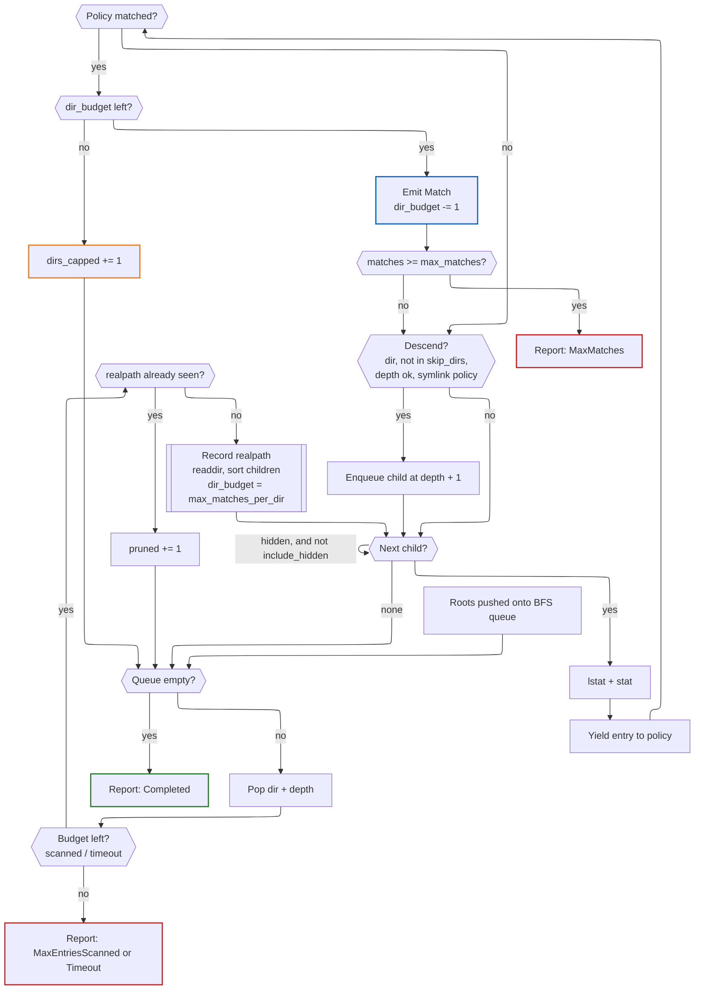
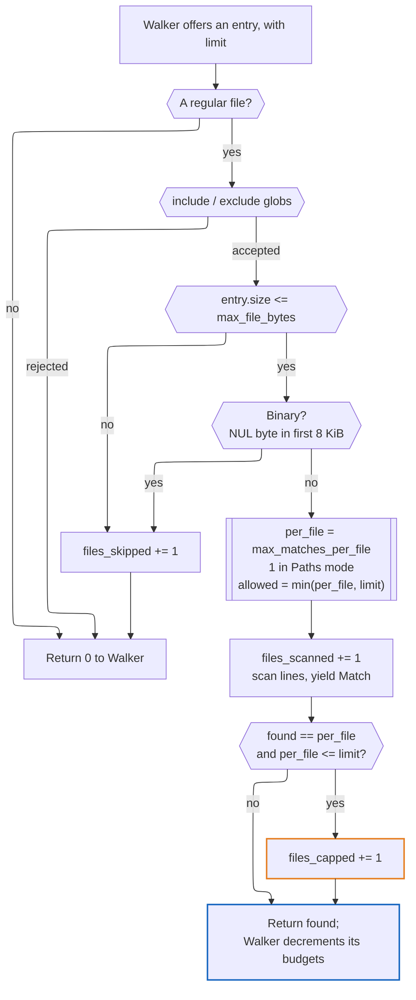
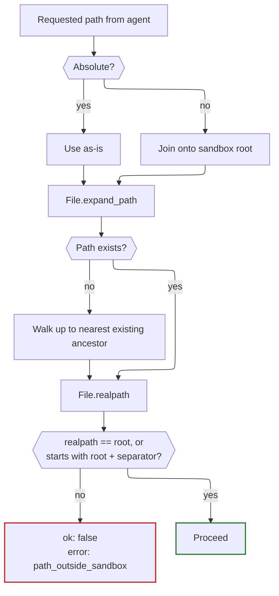

# FsUtils — Design

File system utilities as Crystal classes, so a program can search a tree without
shelling out. Zero runtime dependencies; stdlib only.

The shard has two audiences and they want opposite things.

A **Crystal caller** wants a stream: yield me matches as you find them, let me
decide what to keep, raise if I passed nonsense. An **AI agent** wants a
document: give me a bounded, self-describing JSON blob, never raise, and tell me
what you *didn't* show me. Trying to serve both from one class produces something
that serves neither, so the shard is two layers.

```
FsUtils::Tools   # singletons: sandboxed, buffered, JSON, never raise
      │
FsUtils::Find    FsUtils::Grep    # helpers: streaming, typed, may raise
      └──────┬──────┘
FsUtils::Walker(P)                # one bounded breadth-first traversal
FsUtils::Walk                     # the types both layers speak: Entry, Report, Policy
```

## The thesis, stated once

Every scan is bounded, and *saying that it was bounded* is part of the result.

A human who gets 40,000 hits scrolls past them. An agent cannot see a runaway
scan, cannot press Ctrl-C, pays for every result in tokens, and will then draw
confident conclusions from whatever fragment it happened to see. An agent that
cannot distinguish "there are no more matches" from "I gave up" will cheerfully
report the wrong answer. Hence: caps everywhere, a `stop_reason` on every result,
and a traversal order chosen so that an exhausted budget still yields something
useful.

---

## `FsUtils::Walker`

The traversal core. It knows about directories, budgets, cycles and clocks; it
has no opinion about what makes a match. `Find` and `Grep` are policies layered
over it.

### Generic over its policy

`Walker(P)` takes its policy as a type parameter rather than as an abstract base
class. With a concrete `P`, Crystal monomorphises and inlines the policy calls
exactly as it would a block — so the traversal-object pattern costs nothing over
the `yield` it replaces. Typing the policy as a shared parent would put a vtable
back in the inner loop for no benefit whatever.

`Walk::Policy` is therefore a *module* documenting the contract, included by
policies so the compiler checks them, but never used as a type. Policies may be
structs; they live for exactly one `run`.

```crystal
def visit(entry : Entry, limit : Int32) : Int32   # returns matches emitted
def enter_dir(dir : String, depth : Int32) : Bool # false to prune
def leave_dir(dir : String, depth : Int32) : Nil
```

`limit` is the walker's budget arithmetic made explicit:
`min(remaining directory quota, max_matches - matches so far)`, always positive.
A policy may narrow it — `Grep` applies its own per-file cap — but never exceed
it; a return above `limit` is clamped rather than trusted. A policy is free to
spend the whole limit on one entry, which is precisely what `Grep` does when a
single file yields twenty matches.

Putting the arithmetic here rather than in each helper is the point of the
exercise: the per-directory budget is the thing both helpers previously got
subtly wrong, and it now exists in one place.

### Breadth-first, on purpose

`find(1)` is depth-first, which is exactly wrong here. Depth-first plus a match
limit means the first deep directory you fall into eats the entire budget:
`node_modules` wins, your source tree is never looked at.

Breadth-first spends the budget level by level, so results spread across the top
of the tree — which is where the interesting code lives. Combined with a
per-directory quota, a single fat directory contributes at most its share and is
then skipped for matching purposes; its children are still queued. A buffet with
a serving spoon, rather than a queue of people with buckets.

Children are sorted before queueing, so two runs over an unchanged tree produce
identical output. Reproducibility is worth more to an agent, and to a spec, than
raw speed.

### Budgets

Five independent brakes, each with a default a caller gets for free:

Limit                |Default|Stops                        
---------------------|-------|-----------------------------
`max_matches`        |1_000  |Context blow-out             
`max_matches_per_dir`|100    |One directory dominating     
`max_entries_scanned`|100_000|Needle-free haystacks        
`timeout`            |10s    |Network mounts, spinning rust
`max_depth`          |32     |Pathological nesting         

Plus `skip_dirs`, one deny-list (`Walk::DEFAULT_SKIP_DIRS`) of the usual
sinkholes shared by both helpers
(`.git`, `.hg`, `.svn`, `node_modules`, `lib`, `vendor`, `.venv`, `target`,
`build`, `dist`, `__pycache__`, `.cache`, `.terraform`, `.next`). Pass
`skip_dirs: [] of String` to disable.

Errors — unreadable directories, files that vanish mid-walk — are collected in
`errors`, never raised. A permissions hiccup halfway through should degrade a
result, not destroy it.

### Symlinks and loops

Default `follow_symlinks: false`: symlinks are reported, and matchable as
`type: :symlink`, but never descended. That alone makes cycles impossible.

With `follow_symlinks: true`, each directory is resolved with `File.realpath`
before entry and recorded in a `Set(String)`; a second visit is pruned. This
deduplicates overlapping roots (`["src", "src/."]`) for free. `realpath` costs a
syscall per directory, which is noise next to the `readdir` that follows it.
`max_depth` is the belt to that pair of braces.

### The loop



### `Report`

`Walk::Report` carries `matches`, `scanned`, `directories`, `pruned`,
`dirs_capped`, `errors`, `elapsed` and `stop_reason`. `truncated?` is true when
the stop reason is anything but `Completed` **or** when `dirs_capped > 0`: a
capped directory means the caller saw a sample, whatever the stop reason says.

`dirs_capped` belongs here rather than to `Grep` because `Walker` owns the
per-directory budget, and a counter should live with the thing that decrements
it. Each helper composes this record into its own report — `Grep` adds
`files_skipped` and `files_capped` — rather than inheriting from it, so neither
carries fields that mean nothing to it.

---

## `FsUtils::Find`

A `find(1)`-flavoured filter over `Walker`. Nothing is buffered: the block sees
each hit as it is found, so memory is O(frontier), not O(results).

```crystal
report = FsUtils::Find.new("src", name: ["*.cr"], max_matches: 200).run do |m|
  puts "#{m.path} (#{m.size} bytes)"
end
report.truncated? # => did we stop early, and why
```

`Match` carries `path`, `name`, `type` (file / directory / symlink / other),
`size`, `modification_time`, `depth`, `symlink?`. A record rather than a tuple,
so fields can be added without breaking callers.

**Matching.** `name:` globs match the basename; `path:` globs match the *whole*
path, so they nearly always want a leading `**/` — a single `*` does not cross a
`/`. `exclude:` matches either. Globs are OR-ed within a list and AND-ed across
lists; an empty list means "no opinion". `case_insensitive:` downcases both
sides: crude, correct for ASCII, good enough for filenames.

**Filters.** `type`, `min_size`/`max_size`, `newer_than`/`older_than`,
`min_depth`.

**Omitted deliberately.** No `-exec`, no boolean expression grammar, no
`-printf`. An agent composing shell fragments is a hazard; a typed constructor
is not. Content search belongs in `Grep`.

---

## `FsUtils::Grep`

Content search over the same traversal. Matches are yielded as found — the class
never accumulates a result array, so memory stays flat regardless of tree size.

```crystal
report = FsUtils::Grep.new("TODO", "src", max_matches: 200).run do |m|
  puts "#{m.relative_path}:#{m.line_number}:#{m.column}: #{m.line}"
end
```

`Match` carries `path`, `relative_path`, `line_number`, `column`, `line`,
`matched`, `truncated_line?`. Enough to cite a result; not so much that the
struct becomes a second file API.

`relative_path` is resolved against whichever root the file falls under, longest
root first, with a separator check — a bare prefix test would report
`/srv/project-secrets/x` as being inside `/srv/project`. With no root matching,
the absolute path is returned rather than a mangled one.

`Report` composes `Walk::Report` and adds `files_scanned`, `files_skipped` and
`files_capped`; `truncated?` accounts for the last of those as well as the
walk's own verdict.

### Output modes

`Mode::Lines` (default) yields one `Match` per matching line. `Mode::Paths`
yields one `Match` per *file* — the first hit — then abandons it. The
distinction is a token budget, not a formatting preference: "which files mention
`AuthToken`" is the cheap reconnaissance step, and an agent forced to pull
matching lines to learn a filename pays twenty times over for the privilege.
Early exit makes it markedly faster too.

Under `Paths`, `max_matches` counts files and `max_matches_per_file` is ignored.
The mode reinterprets the caps rather than silently dropping them, which is why
it is an enum and not a boolean flag.

### Type filters

`types: ["cr", "yaml"]` expands via the `TYPES` map into globs unioned with
`include`. Sugar, but sugar that stops a caller hand-rolling `*.{cr,ecr}` and
quietly missing half the files. Unknown names raise — a silent empty result is
the worst possible failure mode for a caller that cannot see the filesystem.

### Scanning one file

`Walker` decides *which* files are offered and hands over a `limit`; `Grep`
decides how much of that allowance it can afford to spend. This is where the
policy contract earns its keep — `Find` ignores `limit`, `Grep` lives by it.

The file's size comes from the entry the walker already stat-ed, so the scanner
never pays for a second syscall to decide whether a file is too big to open.



Three caps converge on every file, and they answer three different questions:
*have I spent my whole budget?* (`max_matches`), *is this one directory drowning
me?* (`max_matches_per_dir`), and *is this one file drowning me?*
(`max_matches_per_file`). The walker folds the first two into `limit` and owns
their counters; only the third belongs to `Grep`.

Hence the condition on `files_capped`. It fires only when the file's own cap was
the binding constraint. If `limit` was tighter, the shortfall is already
explained by `dirs_capped` or a `MaxMatches` stop, and claiming it here would
report the same lost match twice — leaving an agent to conclude that two
different things went wrong when only one did.

### Additional guard rails

Risk                               |Mitigation                                                   
-----------------------------------|-------------------------------------------------------------
Binary files: noise in, garbage out|Sniff first 8 KiB for a NUL byte; skip                       
Huge files                         |`max_file_bytes`, default 5 MB                               
One 2 MB line of minified JS       |`max_line_length`, default 1000; `truncated_line?` flags it  
One lockfile matching on every line|`max_matches_per_file`, default 20; counted in `files_capped`
Pathological regex                 |Timeout checked between files and every 256 lines            
Sheer file count                   |`max_entries_scanned`, default 20,000                        
Unreadable files, races, bad UTF-8 |Rescued per file, counted in `files_skipped`, never fatal    

Only a bad pattern or an unknown type name raises, and both are caller error
caught at construction. A missing root is *not*: like anything else the
filesystem throws at us it lands in `errors`, matching `Find`. That costs a
caller who typos a root an empty result they must read `errors` to explain,
which is the right trade for one vocabulary across both helpers — and `Tools`
checks existence itself anyway, so an agent still gets a clean `path_not_found`.

### Omitted deliberately

No context lines (`-A`/`-B`/`-C`), no `-v`, no parallelism, no `.gitignore`
parsing, no multiline patterns. Context lines in particular change the shape of
`Match` and decouple *matches* from *lines yielded*, at which point `Report`
needs a `lines_yielded` counter so a caller can see what it actually spent.
Each is easy to bolt on later; none is needed to make the tool useful.

---

## Shared vocabulary

Both helpers use one set of names and defaults, because an agent that has learned
one tool should not be ambushed by the next.

Concept           |Decision                                                                
------------------|------------------------------------------------------------------------
Result object     |`Walk::Report`, composed into each helper's own; `truncated?`           
Why we stopped    |`StopReason` — `Completed`, `MaxMatches`, `MaxEntriesScanned`, `Timeout`
Roots             |`Array(String)`, with a single-`String` convenience overload            
Hidden entries    |`include_hidden: false` — agents rarely want dotfile churn              
Time limit        |`timeout : Time::Span`                                                  
Skip list         |one `Walk::DEFAULT_SKIP_DIRS`                                           
Failure           |`FsUtils::Error`; `ArgumentError` reserved for genuine programmer error 
Filesystem trouble|collected into `errors`, never raised                                   

A helper instance is single-use per `run` and not thread-safe. Spawn a new one.

---

## `FsUtils::Tools`

The agent-facing layer: methods that call a helper, buffer the results, and
serialise them. An instance rather than module-level singletons, because the
sandbox root is state that must be set once and honoured on every call — a
global `configure` would make it ambient, and ambient is exactly what a
security boundary must not be.

```crystal
tools = FsUtils::Tools.new("/srv/project")
tools.grep(pattern: "TODO", paths: ["src"], max_matches: 100).to_json
```

Arguments are flat and JSON-friendly — strings, ints, string arrays; no
`Time::Span`, no enums — because they arrive from a model as JSON in the first
place. Enum-ish arguments (`type`, `mode`) are taken as strings and parsed here,
so an unknown value becomes an error code rather than an exception.

Each method returns a `Response(T)`, not a serialised string. A host writes
`.to_json`; a Crystal caller can read `ok?` without re-parsing what was just
serialised. Nil fields are **omitted** rather than emitted as `null`, so a clean
result is a small one and a host can test for a key's presence.

### The sandbox

**This layer refuses to leave its root.** The helpers are for trusted local
callers and take you wherever you point them; the tool layer assumes its caller
is a language model that may have read `../../.ssh/id_rsa` in a prompt somewhere
and thought it looked interesting.

The rule is: resolve, then compare — never validate the string before resolving
it, because `..` and symlinks both launder a string past a naive prefix check.



Three details that matter:

- **The separator check is not optional.** A bare `starts_with?(root)` lets
  `/srv/project-secrets` pass for root `/srv/project`. The same bug used to lurk
  in `Grep#relative`, which is what drew attention to it.
- **Resolve before comparing, and resolve the nearest *existing* ancestor** when
  the path itself does not exist, so a lookup of a missing file inside the
  sandbox is a clean "not found" rather than a resolution error.
- **`follow_symlinks` is forced off** unless the caller explicitly enables it,
  and even then every resolved directory is re-checked against the root. A
  symlink inside the sandbox pointing out of it is the obvious escape.

Paths in the response are returned relative to the sandbox root. The agent never
sees the absolute layout of the host, which is both a small security win and a
meaningful token saving.

**One limitation, stated rather than hidden.** Resolving a path and then reading
it is not atomic. A symlink swapped between the two — by another process on the
same machine, in the window between the check and the open — could redirect the
read. Closing that properly means `openat` with `O_NOFOLLOW` against a held
directory descriptor, which is a substantially larger and more
platform-specific piece of work.

The gap is acceptable for the intended case, an agent reading a workspace whose
other occupants are trusted. It is *not* acceptable if a hostile local process
shares the filesystem, and anyone deploying this into that situation should know
they are relying on a check with a race in it.

### The envelope

One shape for every tool, so an agent learns it once:

```json
{
  "ok": true,
  "results": [
    { "path": "src/find.cr", "line": 42, "column": 5, "text": "# TODO tidy this" }
  ],
  "summary": { "matches": 200, "scanned": 1180, "elapsed_ms": 91, "files_scanned": 96, "files_skipped": 3 },
  "truncated": true,
  "stop_reason": "max_matches",
  "notice": "Stopped at 200 matches; there may be more. Narrow with `include_globs` or a more specific pattern, or raise `max_matches`. 4 files hit their per-file quota; use `mode: \"paths\"` to see which files match instead.",
  "errors": ["src/vendor: permission denied"],
  "errors_omitted": 2
}
```

A clean, complete result carries only `ok`, `results` and `summary`; everything
below is absent unless it has something to say. Five things earn their place:

- **`notice`** is prose aimed at the model. `stop_reason: "max_matches"` is a
  fact; "narrow your query" is an action, and models act on the latter far more
  reliably than they reason from the former. It **accumulates**: a search can
  exhaust its matches, cap files, cap directories and overflow the output budget
  at once, and each adds a sentence carrying its own remedy. The per-file
  sentence points at `mode: "paths"`, which is the cheap reconnaissance step an
  agent would otherwise have to know to reach for unprompted.
- **`ok: false` with an `error` object, never an exception.** A raised Crystal
  exception becomes a stack trace in someone's tool harness. A JSON error is
  something the model can read and recover from. Error codes are a closed set:
  `path_outside_sandbox`, `path_not_found`, `invalid_pattern`, `invalid_argument`.
  A failure carries the error and nothing else — no empty `results` to be
  mistaken for "found nothing".
- **`errors` is capped** at ten (`Tools::MAX_ERRORS`), with `errors_omitted`
  counting the rest. Ten is enough to show the *shape* of the trouble — one
  unreadable directory, or a whole mount denied — while a walk across a
  permissions-denied filesystem would otherwise make the failures the entire
  response and push out the results the agent asked for.
- **`max_output_bytes`**, a limit that exists only at this layer. Grep lines vary
  wildly; 200 matches may be 2 KB or 200 KB, and `max_matches` cannot tell the
  difference. Results are dropped from the tail when the serialised size would
  exceed it, and `truncated` is set with a `notice` that says so. Note the
  asymmetry this creates: `summary.matches` counts what was *found*, which may
  exceed the length of `results`. That is deliberate — an agent should be able to
  see that it is looking at a fraction, and how large a fraction.
- **`truncated`** is the single flag worth branching on. It is true if the walk
  stopped early, if any file or directory forfeited a remainder, or if results
  were dropped to fit the budget — every reason the answer might be a sample.

### Tool schemas

Each tool ships its JSON Schema as a constant — `Tools::FIND_SCHEMA`,
`Tools::GREP_SCHEMA` — so a host can register the tool without hand-writing a
description that drifts from the implementation. The schema is the documentation
the model actually reads, so limits and their defaults are described in it
explicitly.

---

## Roadmap

Done: the `Walker` extraction, `Find` and `Grep` rebased onto it, and `Tools`
over both.

Candidates next, roughly in order of usefulness to an agent: bounded file read
with line ranges; `ls` with metadata; `tree` with a depth cap; and only then
anything that writes. Write tools inside a sandbox are a different conversation,
and a longer one — the TOCTOU gap above is tolerable for reads and considerably
less so for writes.
