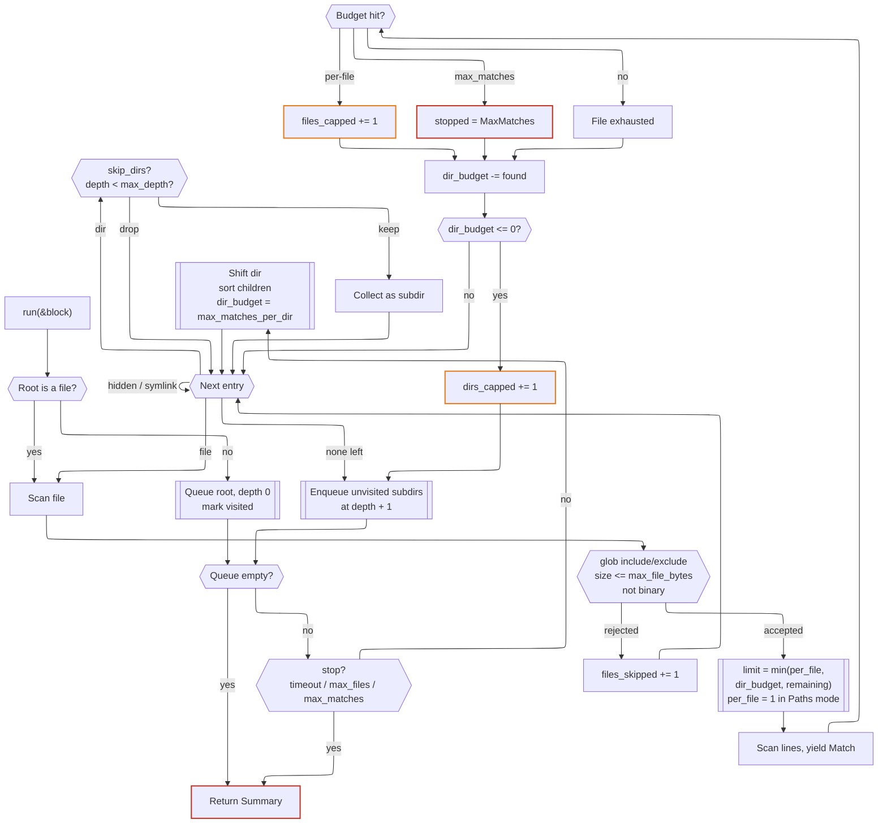

# FsUtils::Grep — design

## Purpose

A `grep`-shaped helper for a future `fs_utils` shard, built to be driven by an AI
agent's `search_files` tool rather than by a human at a terminal. The difference
matters. A human who gets 40,000 hits scrolls past them; an agent pays for every
one of them in tokens and then draws conclusions from whatever fragment it saw.
The class therefore optimises for a *representative* sample of matches, bounded
in size and in time, rather than for completeness.

Zero runtime dependencies: stdlib only.

## Shape of the API

```crystal
grep = FsUtils::Grep.new("TODO", path: "./src", max_matches: 200)

summary = grep.run do |m|
  puts "#{m.relative_path}:#{m.line_number}:#{m.column}: #{m.line}"
end

summary.stopped # => Complete | MaxMatches | MaxFiles | Timeout
```

Matches are yielded as they are found — the class never accumulates a result
array, so memory stays flat regardless of how big the tree is. `run` returns a
`Summary` with counters and, crucially, *why it stopped*: an agent that cannot
tell "no more matches" from "I gave up" will happily report the wrong answer.

`Match` carries `path`, `relative_path`, `line_number`, `column`, `line`,
`matched` and `truncated_line?`. Enough to cite a result; not so much that the
struct becomes a second file API.

## Output modes

`Mode::Lines` (default) yields one `Match` per matching line. `Mode::Paths`
yields one `Match` per *file* — the first hit — and then abandons the file. The
distinction is a token budget, not a formatting preference: "which files mention
`AuthToken`" is the cheap reconnaissance step, and an agent forced to pull
matching lines to learn a filename pays twenty times over for the privilege.
Early exit makes it markedly faster too.

Under `Paths`, `max_matches` counts files and `max_matches_per_file` is ignored.
The mode reinterprets the caps rather than silently ignoring them, which is why
it is an enum rather than a boolean flag.

Context windows (`-A`/`-B`/`-C`) are deliberately deferred: they change the
shape of `Match` (adding `before`/`after` arrays) and decouple *matches* from
*lines yielded*, at which point `Summary` needs a `lines_yielded` counter so a
caller can see what it actually spent.

## Type filters

`types: ["cr", "yaml"]` expands via the `TYPES` map into globs unioned with
`include`. Pure sugar, but sugar that stops an agent hand-rolling
`*.{cr,ecr}` and quietly missing half the files. Unknown names raise rather
than matching nothing — a silent empty result is the worst possible failure
mode for a caller that cannot see the filesystem.

## The fairness problem

The stated worry — one directory, or one file, swallowing the whole budget —
is really one problem with three levers.

**Per-file cap (`max_matches_per_file`, default 20).** A minified bundle or a
lockfile can match on every line. After the cap the file is abandoned and
counted in `files_capped`. The agent learns the file is interesting without
being buried by it.

**Per-directory cap (`max_matches_per_dir`, default 100).** Applies to the
files *directly inside* one directory, not the whole subtree. `node_modules`
gets no more of the budget than `src` does, and a subtree that is genuinely
broad still yields from many directories.

**Breadth-first traversal.** The quiet part, and the one that does most of the
work. Depth-first walks spend the entire budget in the first branch they fall
into; breadth-first spreads the same budget across the top of the tree, which
is where the interesting code usually lives. Combined with the caps, an
exhausted budget yields a shallow, wide, useful sample instead of a deep,
narrow, useless one.

Entries are sorted within a directory so results are deterministic across runs
— reproducibility is worth more to an agent than raw speed.

## Loops and other traps

Symlinks are **not followed** by default; that alone removes the parent-pointing
cycle. When `follow_symlinks: true` is set, each directory is canonicalised with
`File.real_path` and recorded in a visited set before being queued, so a cycle
is entered exactly once. `max_depth` (default 25) is the belt to that pair of
braces.

Other guard rails, all of them defaults an agent gets for free:

Risk                                               |Mitigation                                                                                          
---------------------------------------------------|----------------------------------------------------------------------------------------------------
Binary files (matches are noise, output is garbage)|Sniff first 8 KiB for a NUL byte; skip                                                              
Huge files                                         |`max_file_bytes`, default 5 MB                                                                      
One 2 MB line of minified JS                       |`max_line_length`, default 1000 chars; `truncated_line?` flags it                                   
Vendor/VCS noise                                   |`skip_dirs` defaults to `.git`, `node_modules`, `lib`, `vendor`, `target`, `build`, `dist`, `.cache`
Dotfile churn                                      |Hidden entries skipped unless `hidden: true`                                                        
Pathological regex, huge tree                      |`timeout`, default 10s, checked between files and every 256 lines                                   
Sheer file count                                   |`max_files`, default 20,000                                                                         
Unreadable files, races, bad UTF-8                 |Rescued per file, counted in `files_skipped`, never fatal                                           

Only a bad pattern or a missing root raises (`Grep::Error`). Everything else the
filesystem throws at us is a statistic, not an exception.

## Deliberate omissions

No context lines, no `-v`, no `--files-with-matches`, no parallelism, no
`.gitignore` parsing, no multiline patterns. Each is easy to bolt on later; none
is needed to make the tool useful, and every one of them is another edge case to
get wrong. A `Grep` instance is single-use per `run` and not thread-safe — spawn
a new one instead.

## Flow


